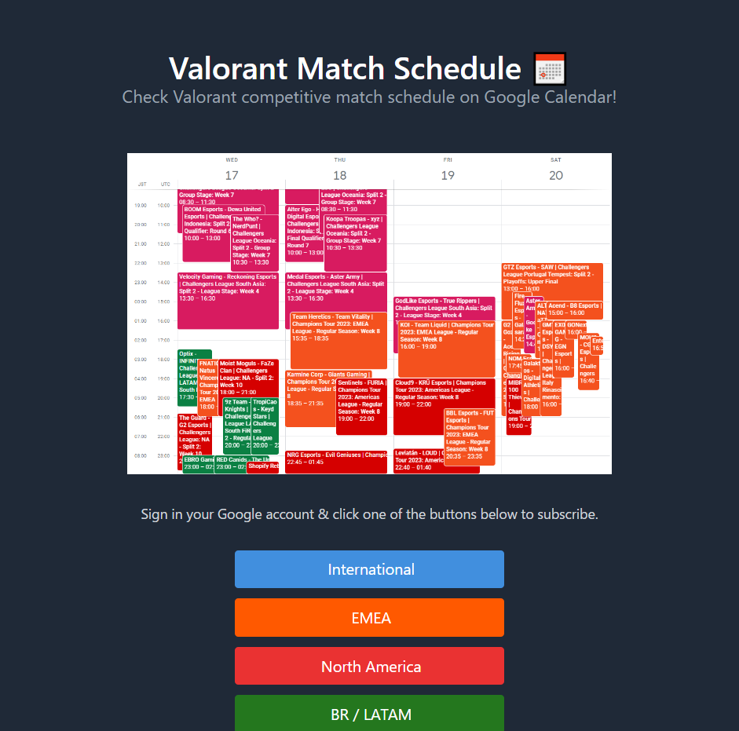

# valorant-calendar.mizt.ch

- [Landing Page](https://valorant-calendar.mizt.ch) of public Google calendars for Valorant competitive match schedule.
- Built using [Hugo](https://gohugo.io/) and [Lynx](https://github.com/jpanther/lynx)

## See Also

- [valorant-match-schedule](https://github.com/miztch/valorant-match-schedule): application provisioning calendar data
- [sasha](https://github.com/miztch/valorant-match-schedule): scraper for vlr.gg upcoming matches
- [dima](https://github.com/miztch/valorant-match-schedule): API for vlr.gg matches harvested with sasha